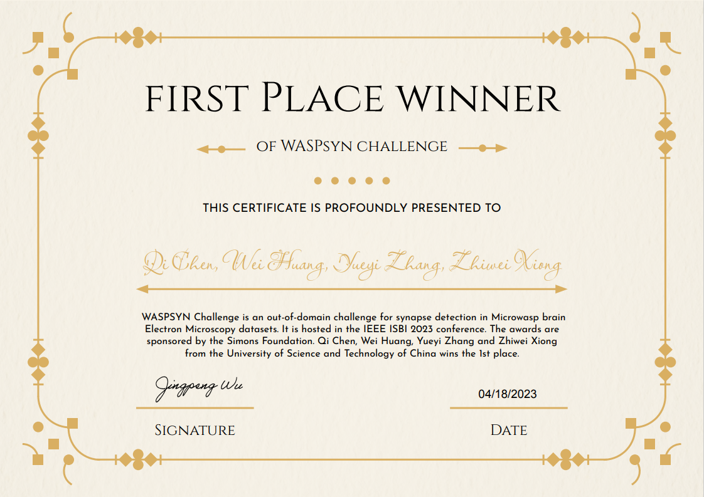
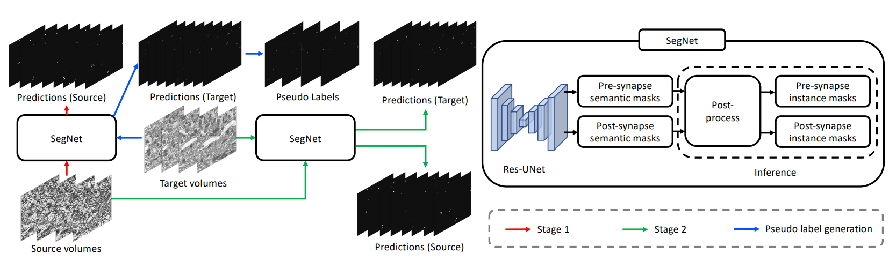

## Domain Adaptive Synapse Detection with Weak Point Annotations (ISBI 2024)

Here is the official code of the 1st team "[VIDAR](https://vidar-ustc.github.io/)" on the [WASPSYN23 Challenge](https://codalab.lisn.upsaclay.fr/competitions/9169/).

🏆 SOTA for 3D Synapse Detection on WASPSYN23.



## Paper
<b>Domain Adaptive Synapse Detection with Weak Point Annotations</b> <br/>
[Qi Chen](https://scholar.google.com/citations?user=4Q5gs2MAAAAJ&hl=en&scioq=Qi+Chen+ustc), [Wei Huang](https://scholar.google.com/citations?user=-pfkprkAAAAJ&hl=en), [Yueyi Zhang](http://home.ustc.edu.cn/~jclee/), [Zhiwei Xiong](http://staff.ustc.edu.cn/~zwxiong/) <br/>
University of Science and Technology of China<br/>
[paper](https://arxiv.org/pdf/2308.16461.pdf) | [code](https://github.com/qic999/AdaSyn) | slides | poster 

## Pipeline



## ⏳ Dataset Link
- [WASPSYN](https://codalab.lisn.upsaclay.fr/competitions/9169/)


## 💡 Acknowledgement
This project is built upon previous projects. Especially, we'd like to thank the contributors of the following github repositories:
- [pytorch_connectomics](https://github.com/zudi-lin/pytorch_connectomics)
- [WASPSYN23](https://github.com/Yicong-Li/WASPSYN23)

## 🛡️ License
This project is under the CC-BY-NC 4.0 license. See [LICENSE](LICENSE) for details.

## 📦 Citation
If you find this work or code is helpful in your research, please cite:
```
@article{chen2023domain,
  title={Domain Adaptive Synapse Detection with Weak Point Annotations},
  author={Chen, Qi and Huang, Wei and Zhang, Yueyi and Xiong, Zhiwei},
  journal={arXiv preprint arXiv:2308.16461},
  year={2023}
}
```


